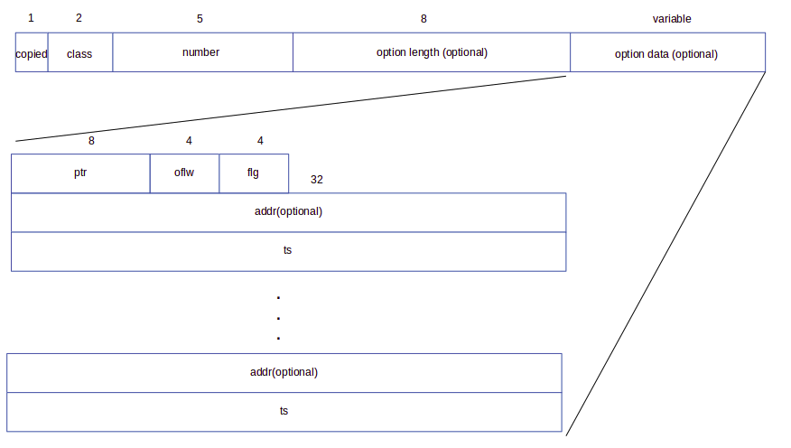

# PAWK Netowrk Field and Builtin Function Reference
## Supported Network Fields
### Packet Level Network Fields
Packet level network fields include those which are about the whole packet, and are accessed by *\$.PKT.\**, where "*" can be

| Field Name | Details |
| --- | --- |
| ts | Timestamp of the packet recorded by LIBPCAP |
| len | The length of the packet |
| caplen | Then captured length of the packet |

#### *ts*
*ts* is the timestamp recored by LIBPCAP when the interface receives or sends the packet (roughly speaking, there will be processing delays), and is the Unix epoch time (since 01/01/1970 00:00:00 UTC) in milliseconds. For the details and pitfalls on how LIBPCAP handles the timestamp, see the [Manpage](https://www.tcpdump.org/manpages/pcap-tstamp.7.html).  
**Note that LIBCAP records the timestamp in seconds, and microseconds since that seconds value. It is converted to milliseconds by PAWK.**

#### *len* and *caplen*
*len* is the length of the packet, and *caplen* is the captured length. For example a packet can have 1000 bytes in total, but only 100 bytes are captured.

### Ethernet Network Fields
Ethernet network fields are accessed by *\$.Ethernet.\**, where "*" can be

| Field Name | Details |
| --- | --- |
| dst\_addr | The destination MAC address |
| src\_addr | The source MAC address |
| type | The EtherType that identifies the protocol used by the payload |
| payload | The payload of Ethernet packet as a binary string |

#### *dst\_addr* and *src\_addr*
Both *dst\_addr* and *src\_addr* are the string representation of the 48 bits MAC address in the form of "xx:xx:xx:xx:xx:xx" where x is any hexadecimal digit.

#### *type*
*type* is the EtherType that identifies the protocol used by the payload, e.g., 0x0800 is for the IPv4 payload. For the complete list of available EtherTypes, see [this page](https://www.iana.org/assignments/ieee-802-numbers/ieee-802-numbers.xhtml#ieee-802-numbers-1).  
**Note that we are talking about Ethernet 2 frame format here, which is the most common format. For the 802.3 frame format, this field is the length of the Ethernet packet. We don't support 802.3 frame format yet. If you see this field <= 1500, it indicates the length in a 802.3 frame.**

#### *payload*
*payload* is everything after the EtherType field as a binary string. Again, we are talking about Ethernet 2 frame format here.

### IPv4 Network Fields
IPv4 network fields are accessed by *\$.IPv4.\**, where "*" can be

|Field Name | Details |
| --- | --- |
| dst\_addr | IPv4 destination address |
| src\_addr | IPv4 source address |
| hdr\_len | IPv4 header length |
| ver | IPv4 version number |
| tos | IPv4 type of service |
| len | IPv4 packet length |
| id | IPv4 fragment id |
| offset | IPv4 fragment offset |
| flag |  IPv4 fragment flag |
| ttl | IPv4 packet ttl |
| proto | IPv4 payload protocol id |
| csum | IPv4 header check sum |
| payload | IPv4 packet payload |
| option.len | IPv4 option lengths |
| option[n].* | IPv4 option field |

#### *dst\_addr* and *src\_addr*
Both *dst\_addr* and *src\_addr* are the string representation of the 32 bit IPv4 address in the form of "x.x.x.x" where *x* is a integer between 0 and 255.

#### *hdr\_len*
*hdr\_len* is the IPv4 header length in bytes. **Note that the actually value of this field is the header length divided by 4. PAWK converts it to the actually header length by multiplying the actual value by 4.**

#### *ver*
*ver* is the version number of IPv4, which is always 4.

#### *tos*
*tos* is the type of the service. It was originally defined in RFC 791, and underwent many revisions in different RFCs. PAWK returns it as a 8 bit integer and it is up to the user on how to interpret it using the bitwise operations offered by AWK.

#### *len*
*len* is the length of the IPv4 packet in bytes, including the IPv4 header and the payload.

#### *id*
*id* is the identification of the IPv4 fragment. The fragments with the same *id* belong to the same IPv4 packet. This is to deal with the IPv4 packet fragmentation when it traverses the Internet.

#### *offset*
*offset* is the offset of the first byte in the IPv4 fragment with respect to the IPv4 packet it belongs to. **Note that the actual *offset* is measured by 8 byte blocks. PAWK converts it to bytes by multiplying it by 8.**

#### *flag*
*flag* contains a 3 bit information. From the most significant bit to the least significant bit they are: bit 0 reserved, and cleared, bit 1 representing "Don't Fragment", and bit 2 representing "More Fragments". Users can use AWK bitwise operations to access each of them.

#### *ttl*
*ttl* is how long a packet can live within a network before it is discarded. In practice, it specifies a hop count. Each router on the path reduces the count by 1. When the count reaches 0, the packet is discarded by the router.

#### *proto*
*proto* identifies the protocol used by the IPv4 payload. For example, 6 indicates that the payload uses TCP protocol.

#### *csum*
*csum* is the IPv4 header checksum.

#### *payload*
*payload* is the IPv4 payload returned as a binary string.

#### *option.len*
*option.len* is the number of the IPv4 options in the header.

#### *option[n].\**
*option[n].\** is used to access any network field within the nth option. For example *option[0].copied* is used to access the *copied* field of the first option. Currently PAWK supports all the common option fields, and IPv4 timestamp option specific fields. The common structure of an IPv4 option is shown below.
  
The number above each field is the length of the field in bits.

### IPv4 Option Common Network Fields
IPv4 supports a range of options within the header, such as source routing, timestamp, etc. They share some common network fields listed below.

Field Name | Details |
| --- | --- |
| copied | Whether the option should be copied in all the fragments of the same packet |
| class | 0 for control options and 2 for debugging&measurement options |
| number | option number |

#### copied
Can be accessed by *$.IPv4.option[n].copied*. It is set to 1 if this option need to be presented in every IPv4 fragment. Set to 0 otherwise.

#### class
Can be accessed by *$.IPv4.option[n].class*. Only number 0 and 2 is allowed. Different options have different class values.

#### number
Can be accessed by *$.IPv4.option[n].number*. Uniquely identify an option within a class, e.g, the IPv4 timestamp option has a *number* of 4 with a *class* of 2.

### IPv4 Option Timestamp Network Fields
The timestmap option allows a device (routers/end hosts) on a path from a source to a destination adds a timestamp in the IPv4 header when it receives an IPv4 packet. It has the following structure.
  

#### len
Can be accessed by *$.IPv4.option[n].len*. Length of the IPv4 timestamp option in bytes. The length includes the common network fields of an IPv4 option.

#### ptr
Can be accessed by *$.IPv4.option[n].ptr*. The byte offset from the beginning of the option (i.e., the *copied* field) to the current end of the option plus 1, that is, it is pointing to the starting position of the next timestamp. A device on a path can use this field to quickly locate the place where it can append its timestamp to the option.

#### oflw
Can be accessed by *$.IPv4.option[n].oflw*. The number of devices that cannot append their timestamps due to the lack of spaces.

#### flg
Can be accessed by *$.IPv4.option[n].flg*. Flag that indicates the format of the timestamps in the option.

Flag | Details |
| --- | --- |
| 0 | Timestamp contains only time field |
| 1 | Timestamp contains IP address and time fields |
| 3 | The IP address fields are pre-specified. A device only appends its timestamp if current IP address matches its own address |

Flag 0 means each timestamp contains a 32 bit integer representing the milliseconds since midnight UT. Flag 1 means each timestamp contains two 32 bit integers of which the first one is the IP address of the device which inserts this timestamp, and the second one is the milliseconds since midnight UT. Flag 3 is basically the same as Flag 1, except that the IP addresses are pre-specified.

#### addr
Can be accessed by *$.IPv4.option[n].addr[m]*. The IP address of the *m*th timestamp.

#### ts
Can be accessed by *$.IPv4.option[n].ts[m]*. The milliseconds of the *m*th timestamp.

#### ts_len
Can be accessed by *$.IPv4.option[n].ts\_len*. The number of timestamp entries in the option. This field can be used in a for loop to access each timestamp entry.

### TCP Network Fields
TCP network fields are accessed by *\$.TCP.\**, where "*" can be

| Field Name | Details                               |
| ---        | ---                                   |
| src\_port  | Source port                           |
| dst\_port  | Destination port                      |
| seq        | Sequence number                       |
| ackno      | Acknowledgment number                 |
| resv       | Reserved bits                         |
| doff       | Data offset                           |
| fin        | fin flag                              |
| syn        | syn flag                              |
| rst        | Reset flag                            |
| psh        | Push flag                             |
| ack        | Acknowledgment flag                   |
| urg        | Urgent flag                           |
| ece        | Explicit congestion echo flag |
| cwr        | Congestion window reduced flag        |
| ns         | ECN-nonce flag                        |
| rwin       | Receiver window size                  |
| chk        | Checksum                              |
| urg_ptr    | Offset pointing to the last urgent byte |

#### src\_port
Can be accessed by *$.TCP.src\_port*. The source port of a TCP packet.

#### dst\_port
Can be accessed by *$.TCP.dst\_port*. The destination port of a TCP packet.

#### seq
Can be accessed by *$.TCP.seq*. The sequence number of a TCP packet.

#### ackno
Can be accessed by *$.TCP.ackno*. The acknowledgment number of a TCP packet.

#### resv
Can be accessed by *$.TCP.resv*. The reserved bits of a TCP packet, for future use, and set to 0s for now.

#### doff
Can be accessed by *$.TCP.doff*. The size of the TCP header in 32-bit words. The minimum value is 5 allowing a header of 20 bytes, the maximum value is 15, allowing a header of 60 bytes.

#### fin
Can be accessed by *$.TCP.fin*. The **fin** flag. If set, the current TCP packet is a **fin** packet.

#### syn
Can be accessed by *$.TCP.syn*. The **syn** flag. If set, the current TCP packet is a **syn** packet.

#### rst
Can be accessed by *$.TCP.rst*. The **reset** flag. If set, the current TCP packet is a **rst** packet.

#### psh
Can be accessed by *$.TCP.psh*. The **push** flag. If set, the sender will push all the buffered data to the network immediately; the receiver will deliver all the buffered data to the application immediately after receiving a packet with **push** flag set. It is mostly used in the interactive programs where a low latency is of utmost importance. However, it does lower the transmission efficiency, since only a little data is sent in every packet.

#### ack
Can be accessed by *$.TCP.ack*. The **acknowledgment** flag. If set, the current TCP header contains a valid acknowledgment number.

#### urg
Can be accessed by *$.TCP.urg*. The **urgent** flag. If set, the current TCP header contains a valid **urgent pointer**.

#### ece
Can be accessed by *$.TCP.ece*. The **explicit congestion echo** flag. If set along with a set **syn** flag, it means that the TCP peer is **ECN** capable. If set with a cleared **syn** flag, it means that a congestion event has happened, and the receiver sends this packet to notify the sender about the event. The whole notification process starts with a router setting the **ecn** flag in the IP header of the packet sent by the sender to indicate that a network congestion event is underway. Upon receiving the packet, the receiver set the **ece** flag in the TCP acknowledgment packet sent to the sender. Upon seeing this flag, the sender can reduce the transmission rate by reducing the congestion window.

#### cwr
Can be accessed by *$.TCP.cwr*. The **congestion window reduced** flag. This flag is set by the sender and sent to the receiver as the response of a set **ece** flag, to notify the receiver that the congestion window is reduced so that the receiver can stop setting the **ece** flag in the TCP acknowledgment packets.

#### ns
Can be accessed by *$.TCP.ns*. The **ECN-nonce** flag. 

#### rwin
Can be accessed by *$.TCP.rwin*. The **receiver window size**. This field together with an optional **window scaling factor** determines the receiver window size.

#### chk
Can be accessed by *$.TCP.chk*. The **checksum**. This field is used to verify the integrity of the TCP packet. It is calculated by using CRC over the TCP header, the payload, and pseudo-header consisting of the source and destination IP addresses, the TCP protocol number, the size of the TCP header, and payload (in bytes).

#### urg_ptr
Can be accessed by *$.TCP.urg_ptr*. The **urgent pointer**. If the **urgent** flag is set, this field is the offset from the sequence number indicating the last urgent data byte. The urgent data is delivered out of order immediately to the receiver without delivering the buffered data before it. Practically, the urgent data feature is rarely used, and may behave quite differently from what one normally think.

    

 

