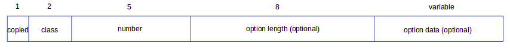

# PAWK Netowrk Field and Builtin Function Reference
## Supported Network Fields
### Packet Level Network Fields
Packet level network fields include those which are about the whole packet, and are accessed by *\$.PKT.\**, where "*" can be

| Field Name | Details |
| --- | --- |
| ts | Timestamp of the packet recorded by LIBPCAP |
| len | The length of the packet |
| caplen | Then captured length of the packet |

#### *ts*
*ts* is the timestamp recored by LIBPCAP when the interface receives or sends the packet (roughly speaking, there will be processing delays), and is the Unix epoch time (since 01/01/1970 00:00:00 UTC) in milliseconds. For the details and pitfalls on how LIBPCAP handles the timestamp, see the [Manpage](https://www.tcpdump.org/manpages/pcap-tstamp.7.html).  
**Note that LIBCAP records the timestamp in seconds, and microseconds since that seconds value. It is converted to milliseconds by PAWK.**

#### *len* and *caplen*
*len* is the length of the packet, and *caplen* is the captured length. For example a packet can have 1000 bytes in total, but only 100 bytes are captured.

### Ethernet Network Fields
Ethernet network fields are accessed by *\$.Ethernet.\**, where "*" can be

| Field Name | Details |
| --- | --- |
| dst\_addr | The destination MAC address |
| src\_addr | The source MAC address |
| type | The EtherType that identifies the protocol used by the payload |
| payload | The payload of Ethernet packet as a binary string |

#### *dst\_addr* and *src\_addr*
Both *dst\_addr* and *src\_addr* are the string representation of the 48 bits MAC address in the form of "xx:xx:xx:xx:xx:xx" where x is any hexadecimal digit.

#### *type*
*type* is the EtherType that identifies the protocol used by the payload, e.g., 0x0800 is for the IPv4 payload. For the complete list of available EtherTypes, see [this page](https://www.iana.org/assignments/ieee-802-numbers/ieee-802-numbers.xhtml#ieee-802-numbers-1).  
**Note that we are talking about Ethernet 2 frame format here, which is the most common format. For the 802.3 frame format, this field is the length of the Ethernet packet. We don't support 802.3 frame format yet. If you see this field <= 1500, it indicates the length in a 802.3 frame.**

#### *payload*
*payload* is everything after the EtherType field as a binary string. Again, we are talking about Ethernet 2 frame format here.

### IPv4 Network Fields
IPv4 network fields are accessed by *\$.IPv4.\**, where "*" can be

|Field Name | Details |
| --- | --- |
| dst\_addr | IPv4 destination address |
| src\_addr | IPv4 source address |
| hdr\_len | IPv4 header length |
| ver | IPv4 version number |
| tos | IPv4 type of service |
| len | IPv4 packet length |
| id | IPv4 fragment id |
| offset | IPv4 fragment offset |
| flag |  IPv4 fragment flag |
| ttl | IPv4 packet ttl |
| proto | IPv4 payload protocol id |
| csum | IPv4 header check sum |
| payload | IPv4 packet payload |
| option.len | IPv4 option lengths |
| option[n].* | IPv4 option field |

#### *dst\_addr* and *src\_addr*
Both *dst\_addr* and *src\_addr* are the string representation of the 32 bit IPv4 address in the form of "x.x.x.x" where *x* is a integer between 0 and 255.

#### *hdr\_len*
*hdr\_len* is the IPv4 header length in bytes. **Note that the actually value of this field is the header length divided by 4. PAWK converts it to the actually header length by multiplying the actual value by 4.**

#### *ver*
*ver* is the version number of IPv4, which is always 4.

#### *tos*
*tos* is the type of the service. It was originally defined in RFC 791, and underwent many revisions in different RFCs. PAWK returns it as a 8 bit integer and it is up to the user on how to interpret it using the bitwise operations offered by AWK.

#### *len*
*len* is the length of the IPv4 packet in bytes, including the IPv4 header and the payload.

#### *id*
*id* is the identification of the IPv4 fragment. The fragments with the same *id* belong to the same IPv4 packet. This is to deal with the IPv4 packet fragmentation when it traverses the Internet.

#### *offset*
*offset* is the offset of the first byte in the IPv4 fragment with respect to the IPv4 packet it belongs to. **Note that the actual *offset* is measured by 8 byte blocks. PAWK converts it to bytes by multiplying it by 8.**

#### *flag*
*flag* contains a 3 bit information. From the most significant bit to the least significant bit they are: bit 0 reserved, and cleared, bit 1 representing "Don't Fragment", and bit 2 representing "More Fragments". Users can use AWK bitwise operations to access each of them.

#### *ttl*
*ttl* is how long a packet can live within a network before it is discarded. In practice, it specifies a hop count. Each router on the path reduces the count by 1. When the count reaches 0, the packet is discarded by the router.

#### *proto*
*proto* identifies the protocol used by the IPv4 payload. For example, 6 indicates that the payload uses TCP protocol.

#### *csum*
*csum* is the IPv4 header checksum.

#### *payload*
*payload* is the IPv4 payload returned as a binary string.

#### *option.len*
*option.len* is the number of the IPv4 options in the header.

#### *option[n].\**
*option[n].\** is used to access any network field within the nth option. For example *option[0].copied* is used to access the *copied* field of the first option. Currently PAWK supports all the common option fields, and IPv4 timestamp option specific fields. The common structure of an IPv4 option is shown below.

### IPv4 Option Common Network Fields
IPv4 supports a range of options within the header, such as source routing, timestamp, etc. They share some common network fields listed below.

Field Name | Details |
| --- | --- |
| copied | Whether the option should be copied in all the fragments of the same packet |
| class | 0 for control options and 2 for debugging&measurement options |
| number | option number |

#### copied
Set to 1 if this option need to be presented in every IPv4 fragment. Set to 0 otherwise.

 

